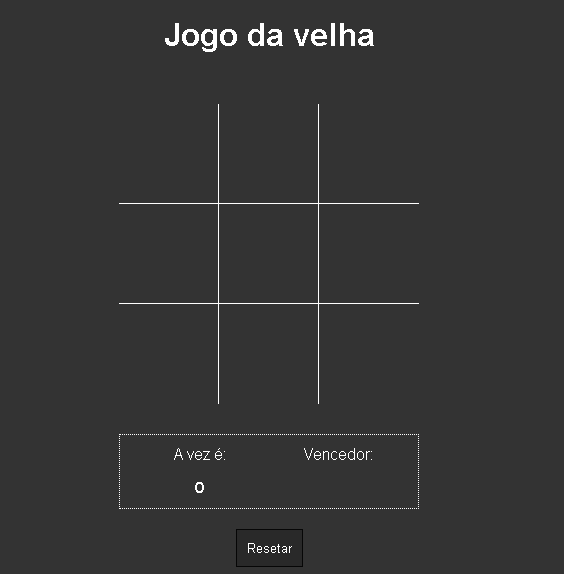

<div align='center'>
  
</div>

## Sobre o projeto 💬

O **Jogo da velha ou jogo do galo** é um jogo de passatempo popular.

## Funcionalidades 🧠

A aplicação contém as seguintes funcionalidades:

### Index.html 📕

- [x] O tabuleiro é uma matriz de três linhas por três colunas. Cada jogador é livre para colocar sua "marca" em qualquer posição vazia no tabuleiro.
- [x] Ao colocar sua marca a jogada passa para o oponente.
- [x] O objetivo do jogo é fazer uma sequência de três símbolos iguais, seja em linha vertical, horizontal ou diagonal

## Pré-requisitos
  Antes de começar, é bom ter instalado um editor para trabalhar com o codigo como o [VSCode](https://code.visualstudio.com/)

### Rodando o Projeto 📖

```bash
# Clone para este repositório
$ git clone <https://github.com/Pedro-AugusCoelho/JogoDaVelha.git>
 
```

## Tecnologias 🛠

Desenvolvido utilizando as seguintes tecnologias:

- [HTML5](https://www.w3schools.com/html/default.asp)
- [CSS3](https://www.w3schools.com/css/)
- [JavaScript](https://www.javascript.com/)

***

<p align="center">Feito por: Pedro Augusto 🧑🏽🤙🏽</p>
